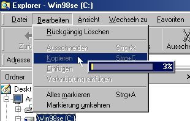

## Cpu Meter

### Description

Display a small CPU Meter next to your mouse cursor ...
 
### More Info
 
none that i know off

             |
---                |---
**Submitted On**   |2000-04-07 17:00:32
**By**             |[X\-LEAD](https://github.com/Planet-Source-Code/PSCIndex/blob/master/ByAuthor/x-lead.md)
**Level**          |Intermediate
**User Rating**    |4.8 (19 globes from 4 users)
**Compatibility**  |VB 5\.0, VB 6\.0
**Category**       |[Windows System Services](https://github.com/Planet-Source-Code/PSCIndex/blob/master/ByCategory/windows-system-services__1-35.md)
**World**          |[Visual Basic](https://github.com/Planet-Source-Code/PSCIndex/blob/master/ByWorld/visual-basic.md)
**Archive File**   |[CODE\_UPLOAD4603472000\.zip](https://github.com/Planet-Source-Code/x-lead-cpu-meter__1-7091/archive/master.zip)

### API Declarations

see zip

